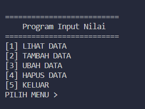
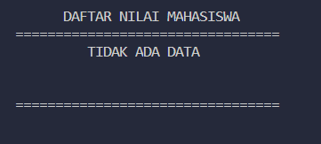
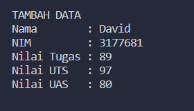
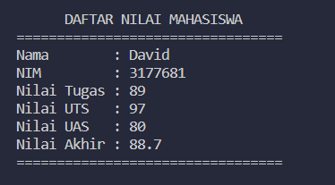
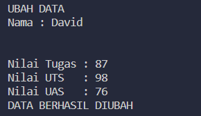
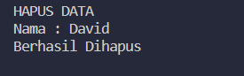
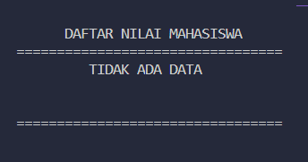
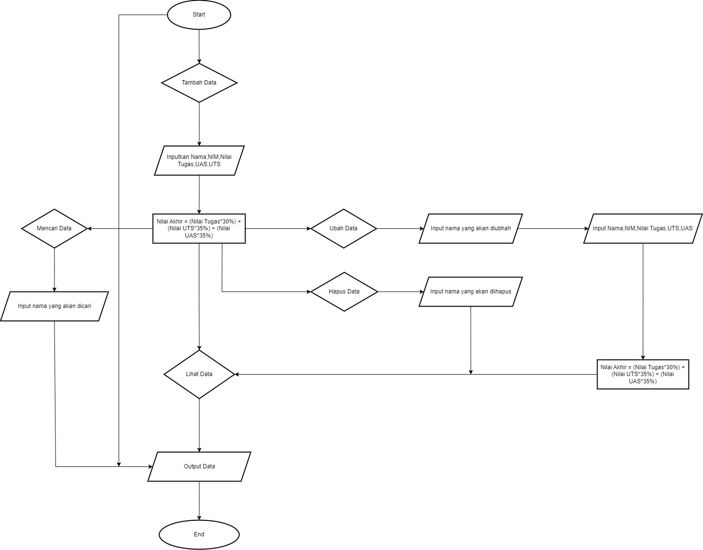
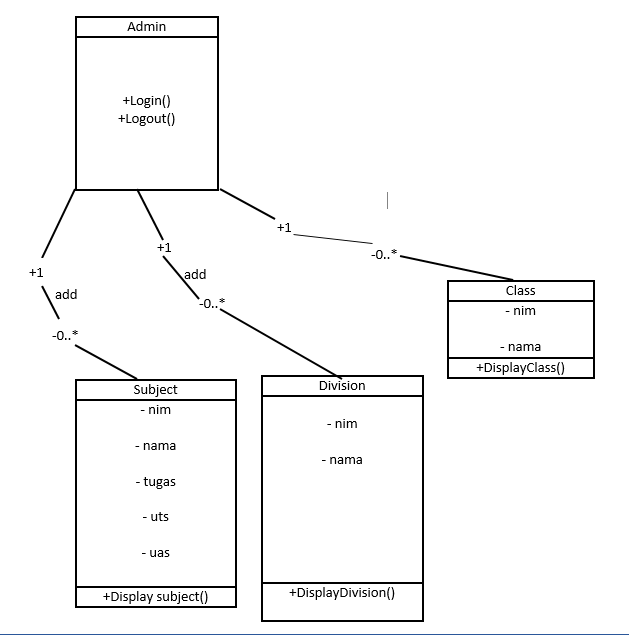

# Praktikum 8
## Membuat data nilai dengan OOP

### Code

Pertama deklarasi class nya terlebih dahulu

```
class Mahasiswa:
    nama = ""
    nim = ""
    uts = ""
    uas = ""
    tugas = ""
    akhir = ""

```

Buat list kosong Data Mahasiswa

    Data Mhs = []

- Buat fungsi tambah
```
def add():
    Mhs = Mahasiswa()
    print("TAMBAH DATA")

    Mhs.nama = input("Nama        : ")
    Mhs.nim  = input("NIM         : ")
    Mhs.tugas = int(input("Nilai Tugas : "))
    Mhs.uts = int(input("Nilai UTS   : "))
    Mhs.uas = int(input("Nilai UAS   : "))
    Mhs.akhir = (Mhs.tugas * 30/100) + (Mhs.uts * 35/100) + (Mhs.uas * 35/100)

    DataMhs.append(Mhs)
```

- Buat fungsi tampilkan

```
def show():
    print("\n")
    print("      DAFTAR NILAI MAHASISWA")
    if len(DataMhs) <= 0:
        print("=================================")
        print("         TIDAK ADA DATA")
        print("\n")
        print("=================================")
    else:
        for Mhs in DataMhs:
            print("=================================")
            print("Nama        : {} ".format(Mhs.nama))
            print("NIM         : {} ".format(Mhs.nim))
            print("Nilai Tugas : {} ".format(Mhs.tugas))
            print("Nilai UTS   : {} ".format(Mhs.uts))
            print("Nilai UAS   : {} ".format(Mhs.uas))
            print("Nilai Akhir : {:.1f} ".format(Mhs.akhir))
            print("=================================")
```

- Buat fungsi untuk menghapus
```
def delete():
    print("HAPUS DATA")
    nama = Mahasiswa()
    nama = input("Nama : ")
    for data in DataMhs:
        if nama == data.nama:
            DataMhs.remove(data)

            print("Berhasil Dihapus")
    
        else:
            print("DATA TIDAK DITEMUKAN")
```

- Buat fungsi untuk ubah
```
def update():
    print("UBAH DATA")
    nama = Mahasiswa()
    nama = input("Nama : ")
    print("\n")

    for data in DataMhs:
        if nama == data.nama:
            data.tugas = int(input("Nilai Tugas : "))
            data.uts = int(input("Nilai UTS   : "))
            data.uas = int(input("Nilai UAS   : "))
            data.akhir = (a.tugas * 30/100) + (a.uts * 35/100) + (a.uas * 35/100)

            print("DATA BERHASIL DIUBAH")

        else:
            print("DATA TIDAK DITEMUKAN")
```

- Buat menu menggunakan looping while
```
while True:
    print("\n")
    print("==========================")
    print("    Program Input Nilai   ")
    print("==========================")

    print("[1] LIHAT DATA")
    print("[2] TAMBAH DATA")
    print("[3] UBAH DATA ")
    print("[4] HAPUS DATA")
    print("[5] KELUAR ")

    ask = input("PILIH MENU >")

    if ask == '1':
        show()

    elif ask == '2':
        add()
    
    elif ask == '3':
        update()
    
    elif ask == '4':
        delete()
    
    elif ask == '5':
        print("\n")
        print("thank you for using the code :) ")

        exit()
```

### Output

- Menu 



- Lihat Data sebelum ditambahkan



- Tambah Data



- Lihat Data setelah Ditambahkan



- Ubah Data 



- Hapus Data



Data akan terhapus



## Diagram Flowchart



## Diagram Class

